# Авторизация

Для доступа к функционалу сайта пользователям необходимо пройти процесс авторизации. Доступ предоставляется только зарегистрированным пользователям, данные которых предварительно добавлены администратором системы.  

## Процесс авторизации
1. Пользователь вводит логин и пароль на странице входа.
2. При успешной валидации данных пользователь получает доступ к интерфейсу сайта.
3. Если введенные данные некорректны, система отобразит сообщение об ошибке.

## Валидация данных
При вводе логина и пароля система проверяет:
- Наличие логина в базе данных.
- Корректность пароля для указанного логина.
- Актуальность учетной записи (активный или деактивированный пользователь).

**Пример заполнения данных:**  

**Пример ошибки валидации:**  
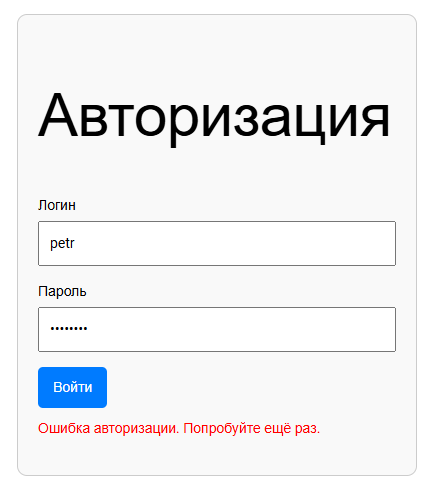

## Успешная авторизация
После успешного входа пользователь перенаправляется на главную страницу приложения, где отображаются доступные функции.

**Пример успешного входа:**  

---

# Страница организаций

Страница управления организациями позволяет добавлять, редактировать и удалять данные об организациях. Она является одной из ключевых страниц приложения, предоставляя доступ к информации, связанной с организациями.

## Функционал страницы организаций

### Отображение данных
На странице отображается список всех организаций.

**Пример отображения страницы в обычном состоянии:**  

### Создание организации
Для добавления новой организации:
1. Заполните форму с данными.
2. Нажмите кнопку "Добавить".
3. После успешного сохранения новая запись появится в списке.

**Пример создания записи:**  

### Изменение данных организации
Для редактирования данных:
1. Выберите организацию из списка.
2. Нажмите кнопку "Изменить".
3. Внесите изменения в форму.
4. Подтвердите изменения нажатием на кнопку "Сохранить изменения".

**Заполнение данных для изменения записи:**  
  

**Успешное изменение записи:**  

### Удаление организации
Для удаления записи:
1. Выберите организацию из списка.
2. Нажмите кнопку "Удалить".
3. На клиенте запись будет удалена из отображения, а в базе данных помечена датой в поле `deleted_at`.

**Удаление записи на клиенте:**  
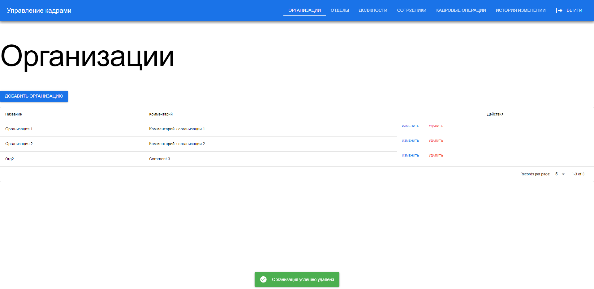

**Отображение удалённой записи в базе данных:**  

Эта страница позволяет эффективно управлять данными об организациях, обеспечивая удобство и безопасность операций. 

---

# Страница отделов

Страница управления отделами позволяет добавлять, редактировать и удалять данные об отделах в организациях. Этот раздел помогает структурировать организационную иерархию.

## Функционал страницы отделов

### Отображение данных
На странице отображается список всех отделов.

**Пример отображения страницы в обычном состоянии:**  
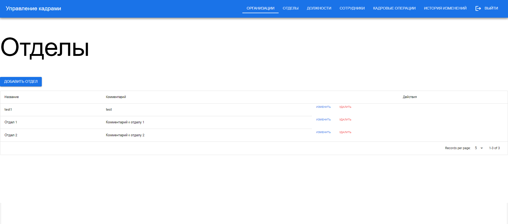

### Создание отдела
Для добавления нового отдела:
1. Заполните форму с данными.
2. Нажмите кнопку "Добавить".
3. После успешного сохранения новая запись появится в списке.

**Пример создания записи:**  
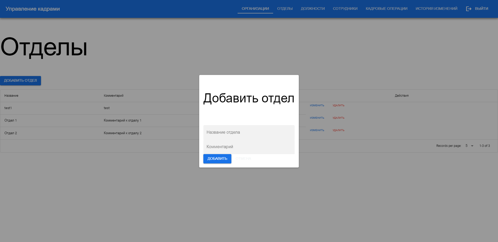

### Изменение данных отдела
Для редактирования данных:
1. Выберите отдел из списка.
2. Нажмите кнопку "Изменить".
3. Внесите изменения в форму.
4. Подтвердите изменения нажатием на кнопку "Сохранить изменения".

**Заполнение данных для изменения записи:**  
  

**Успешное изменение записи:**  
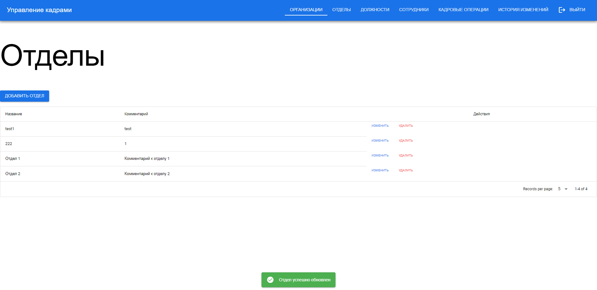

### Удаление отдела
Для удаления записи:
1. Выберите отдел из списка.
2. Нажмите кнопку "Удалить".
3. На клиенте запись будет удалена из отображения, а в базе данных помечена датой в поле `deleted_at`.

**Удаление записи на клиенте:**  

**Отображение удалённой записи в базе данных:**  

Эта страница помогает эффективно управлять структурой организации, обеспечивая удобство и безопасность операций.

---

# Страница должностей

Страница управления должностями предоставляет возможность добавлять, редактировать и удалять должности в рамках организации. Этот раздел помогает структурировать рабочие роли в компании.

## Функционал страницы должностей

### Отображение данных
На странице отображается список всех должностей.

**Пример отображения страницы в обычном состоянии:**  

### Создание должности
Для добавления новой должности:
1. Заполните название должности.
2. Нажмите кнопку "Добавить".
3. После успешного сохранения новая запись появится в списке.

**Пример создания записи:**  
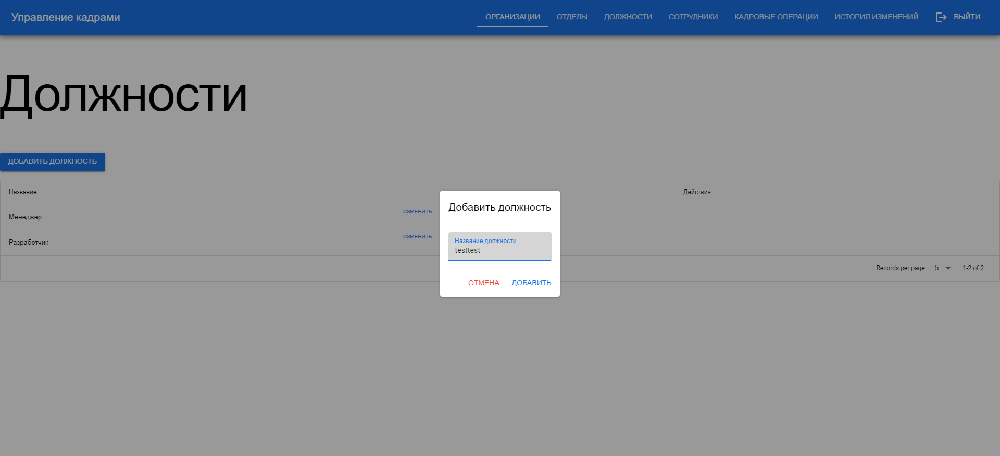

### Изменение данных должности
Для редактирования данных:
1. Выберите должность из списка.
2. Нажмите кнопку "Редактировать".
3. Внесите изменения в форму.
4. Подтвердите изменения нажатием на кнопку "Сохранить изменения".

**Заполнение данных для изменения записи:**  
  

**Успешное изменение записи:**  
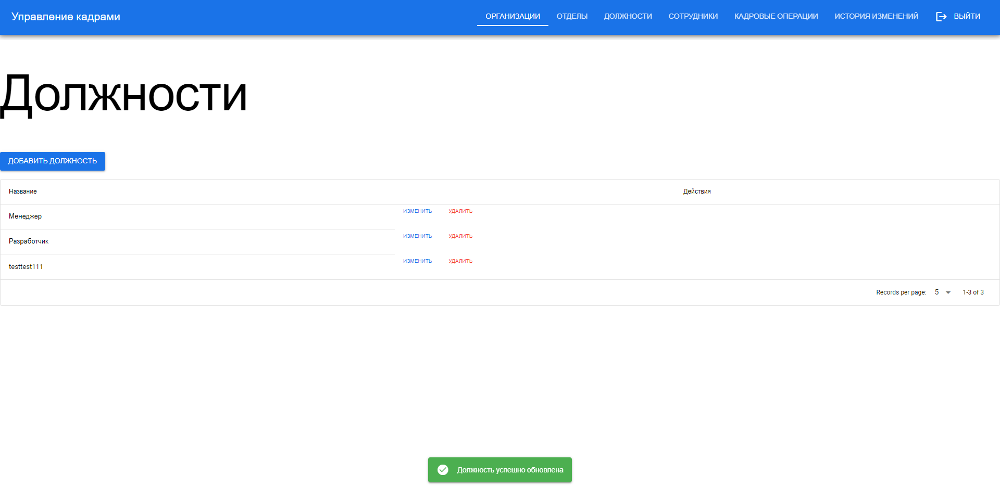

### Удаление должности
Для удаления записи:
1. Выберите должность из списка.
2. Нажмите кнопку "Удалить".
3. На клиенте запись будет удалена из отображения, а в базе данных помечена датой в поле `deleted_at`.

**Удаление записи на клиенте:**  

**Отображение удалённой записи в базе данных:**  

Эта страница помогает эффективно управлять рабочими ролями, обеспечивая удобство и безопасность операций.

---

# Страница сотрудников

Страница управления сотрудниками предоставляет возможность добавлять, редактировать и удалять записи о сотрудниках, а также управлять связанными данными о паспорте и адресе.

## Функционал страницы сотрудников

### Отображение данных
На странице отображается список сотрудников, где данные из таблиц сотрудников, адресов и паспортов объединены. Ввод данных происходит для всех трёх таблиц, а отображение сведено к единой таблице.

**Пример отображения страницы:**  
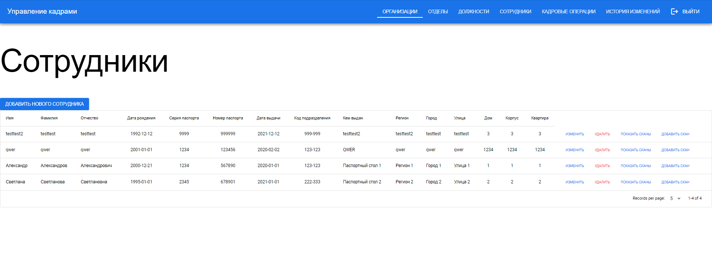

### Создание записи
Для добавления нового сотрудника:
1. Нажмите кнопку "Добавить сотрудника".
2. Заполните формы для ввода данных в таблицы сотрудников, адресов и паспортов.
3. В поле для ввода должности выберите значение из доступных данных БД.
4. После успешного сохранения запись будет добавлена в список.

**Пример создания записи:**  

### Изменение записи
Для редактирования данных:
1. Выберите сотрудника из списка.
2. Нажмите кнопку "Редактировать".
3. Внесите изменения во всех связанных формах (данные сотрудника, паспорт и адрес).
4. Подтвердите изменения нажатием на кнопку "Сохранить изменения".

**Заполнение данных для изменения записи:**  
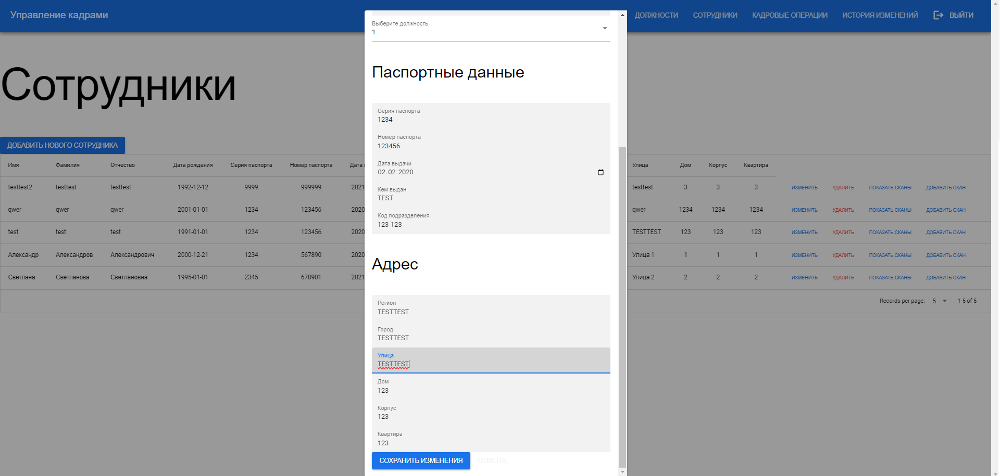  

**Успешное изменение записи:**  

### Удаление записи
Для удаления записи:
1. Выберите сотрудника из списка.
2. Нажмите кнопку "Удалить".
3. На клиенте запись будет удалена из отображения, а в базе данных помечена датой в поле `deleted_at`.

**Удаление записи на клиенте:**  

**Удалённая запись в базе данных:**  

Эта страница обеспечивает удобное управление данными сотрудников и их связанной информацией, соблюдая консистентность данных между таблицами.

---

# Страница файлов

Страница управления файлами предоставляет возможность добавлять, редактировать и удалять записи о файлах, которые будут связаны с сотрудниками.

## Функционал страницы файлов

### Отображение данных
На странице отображается список всех загруженных файлов с указанием их названия и ссылки.

**Пример отображения страницы:**  

### Создание записи
Для добавления нового файла:
1. Напишите название и укажите ссылку на файл.
2. Нажмите кнопку "Добавить".
3. После успешного выполнения файл будет добавлен в список.

**Пример создания записи:**  

### Изменение записи
Для редактирования данных файла:
1. Выберите запись в списке.
2. Нажмите кнопку "Изменить".
3. Обновите информацию о файле (например, название или описание).
4. Нажмите "Сохранить изменения".

**Заполнение данных для изменения записи:**  
  

**Успешное изменение записи:**  

### Удаление записи
Для удаления записи:
1. Выберите запись из списка.
2. Нажмите кнопку "Удалить".
3. Запись будет удалена из списка на клиенте, а в базе данных помечена датой в поле `deleted_at`.

**Удаление записи с уведомлением:**  

**Удалённая запись в базе данных:**  

Страница файлов обеспечивает удобное добавление и редактирование файлов для поддержки данных приложения.

---

# Страница кадровых операций

Страница управления кадровыми операциями предоставляет функциональность для учета и управления различными операциями с сотрудниками, такими как переводы, увольнения, назначения и другие действия, связанные с их трудовой деятельностью.

## Функционал страницы кадровых операций

### Отображение данных
На странице отображаются все кадровые операции, связанные с сотрудниками, включая дату операции и тип операции.

**Пример отображения страницы:**  

### Создание записи
Для добавления новой кадровой операции:
1. Заполните данные, в спадающих списках выберите сотрудника, отдел и должность, для которых необходимо создать операцию.
2. Нажмите кнопку "Добавить".
3. После успешного выполнения операция будет добавлена в список.

**Выбор в спадающих списках, сотрудника, отдела и должности:**  
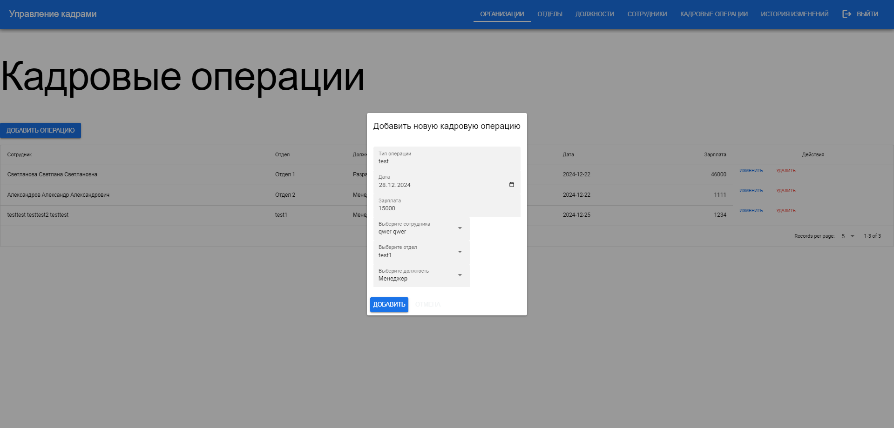

**Успешное добавление записи:**  

### Изменение записи
Для редактирования кадровой операции:
1. Выберите запись в списке.
2. Нажмите кнопку "Изменить".
3. Обновите необходимые данные.
4. Нажмите "Сохранить изменения".

**Заполнение данных для изменения записи:**  
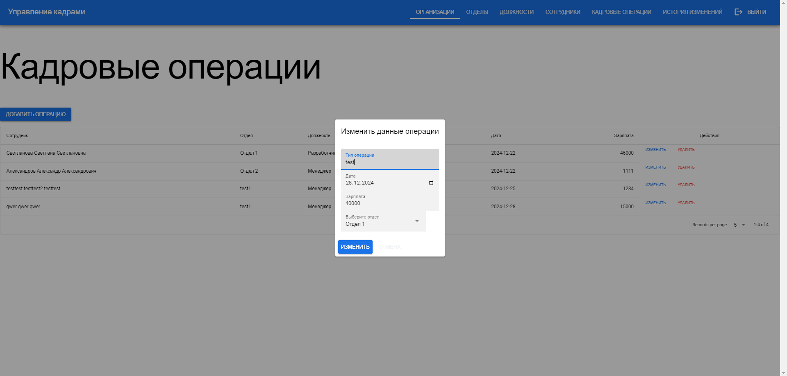

**Успешное изменение записи:**  

### Удаление записи
Для удаления кадровой операции:
1. Выберите запись в списке.
2. Нажмите кнопку "Удалить".
3. Запись будет удалена из списка на клиенте, а в базе данных помечена датой в поле `deleted_at`.

**Удаление записи с сообщением об этом:**  

**Отображение удалённой записи в базе данных (с меткой удаления):**  

Страница кадровых операций обеспечивает удобное управление всеми кадровыми процессами в приложении.

---

# Страница истории изменений
**В разработке**